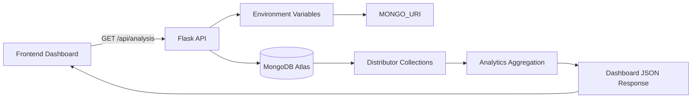
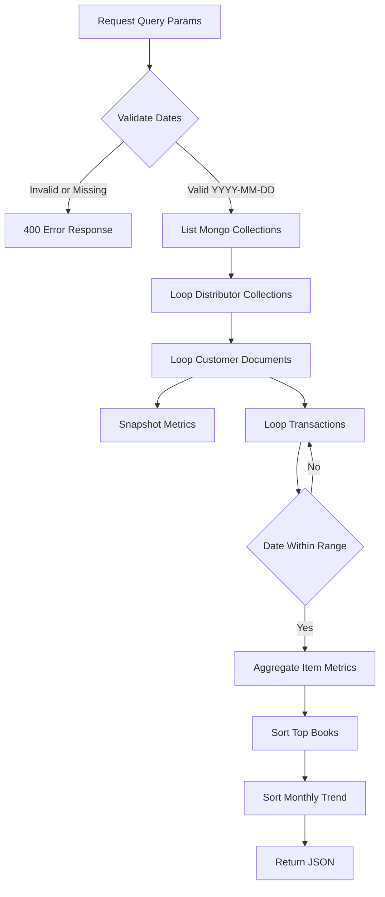

# StarQ Analytics Backend


A lightweight Flask API that converts distributor-wise MongoDB sales collections into dashboard-ready analytics. It aggregates revenue, collection status, monthly trends, subject demand, top books, customer revenue, and outstanding dues through one clean endpoint.

---

## Table of Contents

- [Overview](#overview)
- [Architecture](#architecture)
- [Features](#features)
- [Tech Stack](#tech-stack)
- [Project Structure](#project-structure)
- [Environment Variables](#environment-variables)
- [Local Setup](#local-setup)
- [API Reference](#api-reference)
- [Response Shape](#response-shape)
- [Data Model Assumptions](#data-model-assumptions)
- [Deployment](#deployment)
- [Security Notes](#security-notes)
- [Troubleshooting](#troubleshooting)

---

## Overview

The backend connects to a MongoDB Atlas database named `StarQ`, scans each collection as a distributor, reads customer sales transactions, and returns summarized metrics for analytics dashboards.



---

## Architecture



The API combines two types of analytics:

| Metric Type | Date Filtered | Description |
| --- | --- | --- |
| Transaction analytics | Yes | Revenue, monthly trend, books sold, subject distribution, customer revenue |
| Snapshot analytics | No | Total collected amount, total due amount, outstanding dues |

---

## Features

- Distributor-wise revenue calculation
- Monthly revenue trend generation
- Collected vs due comparison
- Subject-wise book distribution
- Top 10 books by net copies
- Customer-wise revenue aggregation
- Outstanding dues by customer
- CORS-enabled API access for frontend clients
- Environment-based MongoDB configuration
- Gunicorn-compatible production startup

---

## Tech Stack

| Layer | Technology |
| --- | --- |
| API Framework | Flask |
| Database | MongoDB Atlas |
| MongoDB Driver | PyMongo |
| Environment Config | python-dotenv |
| Cross-Origin Access | Flask-CORS |
| Production Server | Gunicorn |

---

## Project Structure

```text
analyticsBackend/
+-- app.py              # Flask application and analytics endpoint
+-- requirements.txt    # Python dependencies
+-- .env.example        # Environment variable template
+-- .gitignore          # Ignored local/runtime files
+-- README.md           # Project documentation
```

---

## Environment Variables

Create a `.env` file in the `analyticsBackend` directory:

```env
MONGO_URI="mongodb+srv://<db_username>:<db_password>@<cluster-url>/?appName=<app-name>"
PORT=5000
```

| Variable | Required | Default | Purpose |
| --- | --- | --- | --- |
| `MONGO_URI` | Yes | None | MongoDB Atlas connection string |
| `PORT` | No | `5000` | Port used when running `app.py` directly |

> Keep `.env` private. It is already listed in `.gitignore` and should never be committed.

---

## Local Setup

### 1. Clone or open the backend folder

```bash
cd analyticsBackend
```

### 2. Create a virtual environment

```bash
python -m venv .venv
```

### 3. Activate the virtual environment

Windows PowerShell:

```powershell
.\.venv\Scripts\Activate.ps1
```

macOS/Linux:

```bash
source .venv/bin/activate
```

### 4. Install dependencies

```bash
pip install -r requirements.txt
```

### 5. Configure environment variables

```bash
cp .env.example .env
```

Update `.env` with your MongoDB Atlas connection string.

### 6. Run the API

```bash
python app.py
```

The API will run at:

```text
http://localhost:5000
```

---

## API Reference

### Get Dashboard Analytics

```http
GET /api/analysis?start_date=YYYY-MM-DD&end_date=YYYY-MM-DD
```

| Query Parameter | Type | Required | Example | Description |
| --- | --- | --- | --- | --- |
| `start_date` | string | Yes | `2025-01-01` | Start date for transaction-level analytics |
| `end_date` | string | Yes | `2025-12-31` | End date for transaction-level analytics |

Example request:

```bash
curl "http://localhost:5000/api/analysis?start_date=2025-01-01&end_date=2025-12-31"
```

Success response:

```http
200 OK
Content-Type: application/json
```

Validation errors:

| Status | Cause | Response |
| --- | --- | --- |
| `400` | Missing dates | `{"error": "Start and end dates are required."}` |
| `400` | Invalid date format | `{"error": "Invalid date format. Use YYYY-MM-DD"}` |

---

## Response Shape

```json
{
  "revenue_by_distributor": {
    "Distributor A": 125000
  },
  "monthly_trend": {
    "2025-01": 45000,
    "2025-02": 80000
  },
  "collections_vs_due": {
    "Collected": 100000,
    "Due": 25000
  },
  "subject_distribution": {
    "Maths": 120,
    "Physics": 90,
    "Chemistry": 75,
    "Botany": 40,
    "Zoology": 35,
    "Sanskrit": 20,
    "Other": 10
  },
  "top_books": {
    "Example Book Title": 50
  },
  "customer_revenue": {
    "Customer Name": 30000
  },
  "outstanding_dues": {
    "Customer Name": 5000
  }
}
```

### Dashboard Visualization Mapping

| Response Key | Recommended Chart |
| --- | --- |
| `revenue_by_distributor` | Bar chart |
| `monthly_trend` | Line chart |
| `collections_vs_due` | Donut chart or KPI cards |
| `subject_distribution` | Pie chart or stacked bar chart |
| `top_books` | Horizontal bar chart |
| `customer_revenue` | Ranked table or bar chart |
| `outstanding_dues` | Priority table |

---

## Data Model Assumptions

Each MongoDB collection is treated as one distributor. Each document is expected to represent a customer account with fields similar to:

```json
{
  "Customer": "Customer Name",
  "Collection": 10000,
  "Total_Due": 2500,
  "Transactions": [
    {
      "Date": "2025-01-15",
      "Items": [
        {
          "Title": "Maths Book",
          "Net_Copies": 20,
          "Amount": 5000
        }
      ]
    }
  ]
}
```

Supported transaction date formats include:

- Python/MongoDB datetime values
- MongoDB extended JSON date values using `$date`
- ISO-style date strings where the first 10 characters are `YYYY-MM-DD`

Subject distribution is inferred from book titles using simple keyword matching:

| Subject | Matching Text |
| --- | --- |
| Maths | `math` |
| Physics | `phy` |
| Chemistry | `che` |
| Botany | `bot` |
| Zoology | `zoo` |
| Sanskrit | `skt`, `sanskrit` |
| Other | Fallback category |

---

## Deployment

The project includes `gunicorn` for production hosting.

Example production command:

```bash
gunicorn app:app
```

For platforms such as Render, Railway, or similar Python hosting services:

| Setting | Value |
| --- | --- |
| Root Directory | `analyticsBackend` |
| Build Command | `pip install -r requirements.txt` |
| Start Command | `gunicorn app:app` |
| Required Environment Variable | `MONGO_URI` |

---

## Security Notes

- Never commit `.env` or raw database credentials.
- Use MongoDB Atlas IP access rules appropriate for your deployment platform.
- Create a database user with the minimum permissions required by this API.
- Rotate credentials immediately if a connection string is accidentally shared.
- Consider adding authentication before exposing analytics data publicly.

---

## Troubleshooting

| Issue | Likely Cause | Fix |
| --- | --- | --- |
| `No MONGO_URI found in environment variables.` | `.env` missing or variable not set | Create `.env` and add `MONGO_URI` |
| `Invalid date format. Use YYYY-MM-DD` | Incorrect query date format | Use dates like `2025-01-01` |
| Empty charts | No transactions inside selected date range | Try a wider date range |
| MongoDB connection error | Invalid URI, network issue, or Atlas access rule | Check credentials, cluster status, and IP access list |
| CORS issue in frontend | Browser blocked cross-origin request | Confirm Flask-CORS is installed and the backend is running |

---

## Maintainer Notes

Recommended future improvements:

- Add a health check endpoint such as `GET /health`
- Add pagination or caching for large MongoDB datasets
- Add automated tests for date parsing and aggregation behavior
- Move subject classification into a configurable mapping
- Add authentication and request logging for production use
